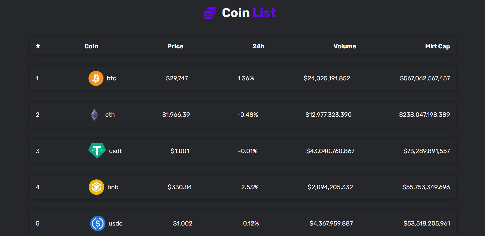

# Coin List Project

## About

A display of top 50 cryptocurrencies with their details and real-time prices.

## Languages: React, CSS

## Features

Track the price of each cryptocurrency and display it in real-time with its 24-hour highs and lows and its historical fluctuations.

## Challenges

Fetching data using crypto API and displaying it in real-time using state management in React. Made use of { useState, useEffect } hooks, and axios library for the same purpose.
